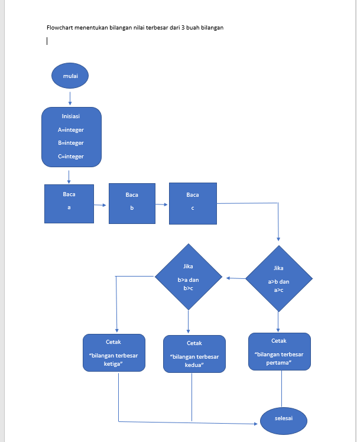
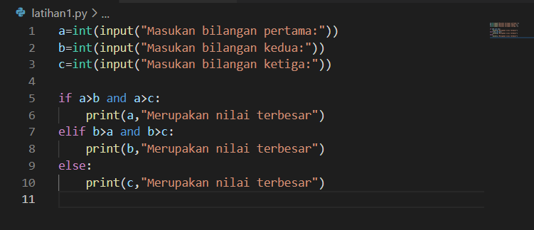
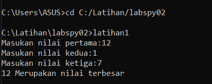
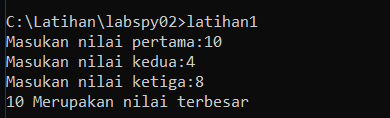
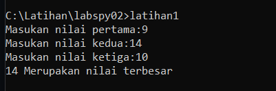

# TUGAS PRAKTIKUM 2
## Labspy02

### Menentukan bilangan terbesar dari 3 bilangan
-Flowchart

### Statement if

-keterangan

    a=bilangan pertama

    b=bilangan kedua

    c=bilangan ketiga
    
-Maka saya membuat program seperti berikut

### Hasil Program
-Untuk hasil yg pertama contoh nya seperti ini

(12)merupakan nilai terbesar karna 12>1 dan 12>

-untuk hasil kedua saya contohkan seperti ini

(10)merupakan nilai terbesar karna 10>4 dan 10>8

-untuk hasil ketiga saya buat seperti ini

(14)merupakan nilai terbesar karena 14>10 dan 14>9

### Sekian terima kasih
